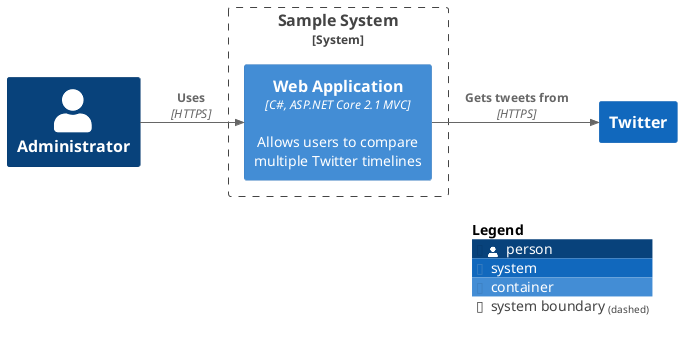

## C4 library (C4-PlantUML) [C4]

### Overview

|property      | value                    |
|--------------|--------------------------|
|name:         | c4                       |
|display_name: | C4 (C4-PlantUML)         |
|description:  | The C4 library enables a simple way of describing and communicate software architectures with an intuitive language.
|author:       | kirchsth, Victor Lupu and Ricardo Niepel
|version:      | 2.11.0                   |
|release:      | https://github.com/plantuml-stdlib/C4-PlantUML/tree/release/v2.11.0
|              |                          | 
|source:       | https://github.com/plantuml-stdlib/C4-PlantUML
|issues:       | https://github.com/plantuml-stdlib/C4-PlantUML/issues
|discussions:  | https://github.com/plantuml-stdlib/C4-PlantUML/discussions
|license:      | MIT, details see [LICENSE](https://github.com/plantuml-stdlib/C4-PlantUML/blob/master/LICENSE)
|copyright:    | Copyright (c) 2020 - 2025 kirchsth, Victor Lupu and Ricardo Niepel

### Description

The C4 library enables a simple way of describing and communicate software architectures with an intuitive language.

It is the PlantUML integrated version of [C4-PlantUML](https://github.com/plantuml-stdlib/C4-PlantUML) and has the big advantage that it can be used without additional external includes.
(E.g. container diagrams can be drawn with `!include <C4/C4_Container>` and no `!include https://raw.githubusercontent.com/plantuml-stdlib/C4-PlantUML/master/C4_Container.puml` is required.)

Example of usage:

This example renders the following image:

